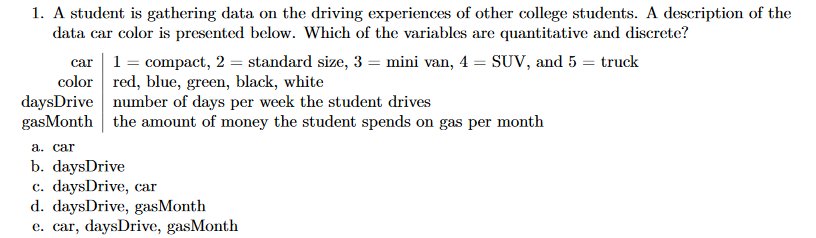
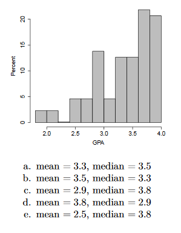
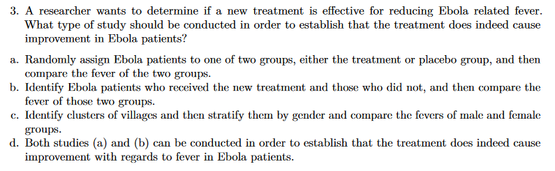
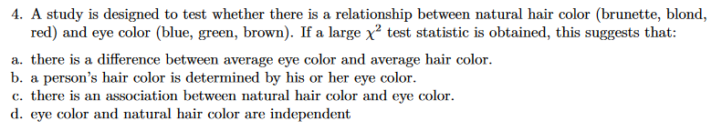
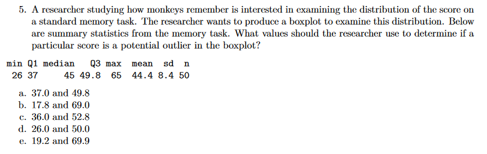
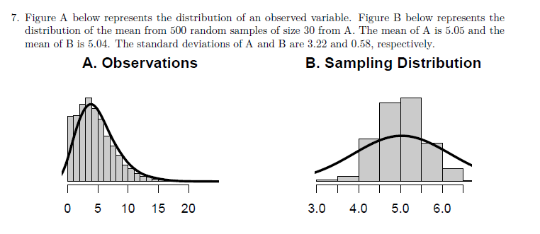

#CUNY DATA606 -Final Exam

```{r message=FALSE,warning=FALSE,echo=FALSE}
library(ggplot2)
library(knitr)
```

-------
### <b><span style="color: #8e321f">Q1</span> </b>  


####<b> <span style="color: #2234cd">Answer ->  b. daysDrive (quantitative and discrete variable)</span> </b>

* Car is a qualitative  categorical variable with numerical labels -> rejected
* Color is a  qualitative or categorical  variable -> rejected
* GasMonth  is a Quantitative  continuous variable -> rejected      

**********

### <b><span style="color: #8e321f">Q2</span> </b>

A histogram of the GPA of 132 students from this course in Fall 2012 class is presented below. Which
estimates of the mean and median are most plausible?    


####<b> <span style="color: #2234cd">Answer -> a. mean=3.3, median=3.5</span> </b>    


Above distribution is left skewed, then the mean is smaller than the median.
The middle value could be around 66 ( 132+1)/2. When considering the density of the above histogram this value could fall close to 3.5 GPA which is the median of the distribution. 3.8 median is not possible and it is bit higher.
  
*******
### <b><span style="color: #8e321f">Q3</span> </b> 



####<b> <span style="color: #2234cd">Answer -> d. Both studies (a) and (b) can be conducted in order to establish that the treatment does indeed cause improvement with regards to fever in Ebola patients.</span> </b> 

*******
### <b><span style="color: #8e321f">Q4</span> </b>



####<b> <span style="color: #2234cd">Answer -> a.there is a difference between average eye color and average hair color.</span> </b> 

Above study is based on two categorical variables done in a large population.
It is possible to create below probability calculation table to find values for these two categorical variables.

```{r message=FALSE,warning=FALSE,echo=FALSE,background}
mt1 <- matrix(c("|   n1","|   n2","|   n3","|   n4","|   n5","|   n6","|   n7","|   n8","|   n9"),ncol=3,byrow=TRUE)
colnames(mt1) <- c("brunette","blond","red")
rownames(mt1) <- c("blue","green","brown")
mt1 <- as.table(mt1)
mt1
```
I can setting up the hypothesis test as follows:

\(H_0:\) Exists association between natural hair color and eye color.

\(H_A:\) No association between natural hair color and eye color.

Since we have a large chi-square values it would suggest strong evidence favoring the alternative hypothesis.
There for the answer would be -> a.there is a difference between average eye color and average hair color.


*******
### <b><span style="color: #8e321f">Q5</span> </b> 



####<b> <span style="color: #2234cd">Answer -> b. 17.8 and 69.0</span> </b> 


$IQR = Q_3 - Q_1 => IQR=49.8  - 37 => 12.8$      

$Lower_outlier => Q_1 - 1.5*IQR => 37-1.5*12.8 =>17.8$      
$Upper_outlier => Q_3 + 1.5*IQR => 49.8+1.5*12.8 => 69$     


*******
### <b><span style="color: #8e321f">Q6</span> </b>

####<b> <span style="color: #2234cd">Answer -> d. The <b>median and interquartile range </b> are resistant to outliers, whereas the <b>mean and standard deviation </b> are not.</span> </b> 

*******
### <b><span style="color: #8e321f">Q7</span> </b>    
### <b><span style="color: #8e321f">Part I</span> </b>


####A. Observations
$\mu = 5.05$  ,  $\sigma = 3.22$  ,  $n = 500$

####B. Sampling Distribution
$\mu\bar{x} = 5.04$  ,  $\sigma\bar{x} =  \frac{\sigma}{\sqrt(n)} = 0.58$  ,  $n = 30$

####<b> <span style="color: #2234cd">a. Describe the two distributions (2 pts).</span> </b> 

  * Both A. Observations and B. Sampling Distribution are uni-model.        
  * A. Observations is skewed to the right .     
  * B. Sampling looks normally distributed.
  * Median is lower than the Mean in A. Observations

####<b> <span style="color: #2234cd">b. Explain why the means of these two distributions are similar but the standard deviations are not (2pts)</span> </b> 

* B. Sampling Distribution has the mean from 500 random samples of size 30 from A, expect the mean of this distribution to be similar to the mean of the original population A as per application of the central Limit Theorem. The standard deviation of the sample mean describe the margin of error from the estimate to the true mean of the population. It is call the Standard Error and can be found by formula 
$SE = \frac{\sigma}{\sqrt(n)} = 0.58$

####<b> <span style="color: #2234cd">c. What is the statistical principal that describes this phenomenon (2 pts)? </span> </b> 
  * Central Limit theorem

*******
### <b><span style="color: #8e321f">Part II</span> </b>

####Data Sets:
```{r}
options(digits=2)
data1 <- data.frame(x=c(10,8,13,9,11,14,6,4,12,7,5),
                    y=c(8.04,6.95,7.58,8.81,8.33,9.96,7.24,4.26,10.84,4.82,5.68))

data2 <- data.frame(x=c(10,8,13,9,11,14,6,4,12,7,5),
                    y=c(9.14,8.14,8.74,8.77,9.26,8.1,6.13,3.1,9.13,7.26,4.74))

data3 <- data.frame(x=c(10,8,13,9,11,14,6,4,12,7,5),
                    y=c(7.46,6.77,12.74,7.11,7.81,8.84,6.08,5.39,8.15,6.42,5.73))

data4 <- data.frame(x=c(8,8,8,8,8,8,8,19,8,8,8),
                    y=c(6.58,5.76,7.71,8.84,8.47,7.04,5.25,12.5,5.56,7.91,6.89))
```
####<b> <span style="color: #2234cd">For each column, calculate (to two decimal places):</span> </b> 
####<b> <span style="color: #8000ff">a. The mean (for x and y separately; 1 pt).</span> </b>
```{r}
d1mean.x <- round(mean(data1$x),2)
d1mean.y <- round(mean(data1$y),2)

d2mean.x <- round(mean(data2$x),2)
d2mean.y <- round(mean(data2$y),2)

d3mean.x<- round(mean(data3$x),2)
d3mean.y <- round(mean(data3$y),2)

d4mean.x <- round(mean(data4$x),2)
d4mean.y <- round(mean(data4$y),2)

```   

| Data |     Mean x  |     Mean y   |
|------|-------------|--------------|
|data1 |`r d1mean.x` | `r d1mean.y` |
|data2 |`r d2mean.x` | `r d2mean.y` |
|data3 |`r d3mean.x` | `r d3mean.y` |
|data4 |`r d4mean.x` | `r d4mean.y` |
|-----------------------------------|

*******************
####<b> <span style="color: #8000ff">b. The median  (for x and y separately; 1 pt).</span> </b>
```{r}
d1med.x <- round(median(data1$x),2)
d1med.y <- round(median(data1$y),2)

d2med.x <- round(median(data2$x),2)
d2med.y <- round(median(data2$y),2)

d3med.x<- round(median(data3$x),2)
d3med.y <- round(median(data3$y),2)

d4med.x <- round(median(data4$x),2)
d4med.y <- round(median(data4$y),2)
```   
| Data |     Median x  |     Median y   |
|------|---------------|----------------|
|data1 |  `r d1med.x`  |  `r d1med.y`   |
|data2 |  `r d2med.x`  |  `r d2med.y`   |
|data3 |  `r d3med.x`  |  `r d3med.y`   |
|data4 |  `r d4med.x`  |  `r d4med.y`   |
|---------------------------------------|
*******************
####<b> <span style="color: #8000ff">c. The standard deviation (for x and y separately; 1 pt).</span> </b>
```{r}
d1sd.x <- round(sd(data1$x),2)
d1sd.y <- round(sd(data1$y),2)

d2sd.x <- round(sd(data2$x),2)
d2sd.y <- round(sd(data2$y),2)

d3sd.x <- round(sd(data3$x),2)
d3sd.y <- round(sd(data3$y),2)

d4sd.x <- round(sd(data4$x),2)
d4sd.y <- round(sd(data4$y),2)
```
| Data |   SD x      |    SD y      |
|------|-------------|--------------|
|data1 |`r d1sd.x`   | `r d1sd.y`   |
|data2 |`r d2sd.x`   | `r d2sd.y`   |
|data3 |`r d3sd.x`   | `r d3sd.y`   |
|data4 |`r d4sd.x`   | `r d4sd.y`   |

```{r}
summary(data1)
summary(data2)
summary(data3)
summary(data4)
```
####<b> <span style="color: #2234cd">For each x and y pair, calculate (also to two decimal places; 1 pt)</span> </b> 
####<b> <span style="color: #8000ff">d. The correlation (1 pt).</span> </b>
```{r}
par(mfrow=c(2,2))
plot(data1,main = "data1")
plot(data2,main = "data2")
plot(data3,main = "data3")
plot(data4,main = "data4")
```

###Data1
```{r}
#plot(data1)
round(cor(data1),2)
```
###Data2
```{r}
#plot(data2)
round(cor(data2),2)
```
###Data3
```{r}
#plot(data3)
round(cor(data3),2)
```
###Data4
```{r}
#plot(data4)
round(cor(data4),2)
```
####<b> <span style="color: #8000ff">e. Linear regression equation (2 pts).</span> </b>
###Data1    
```{r}
lm1<-lm(y~x,data=data1)
summary(lm1)
```
```{r}
par(mfrow=c(2,2))
plot(lm1)
``` 

###Data2    
```{r}
lm2<-lm(y~x,data=data2)
summary(lm2)
```
```{r}
par(mfrow=c(2,2))
plot(lm2)
``` 

###Data3    
```{r}
lm3<-lm(y~x,data=data3)
summary(lm3)
```
```{r}
par(mfrow=c(2,2))
plot(lm3)
``` 

###Data4    
```{r}
lm4<-lm(y~x,data=data4)
summary(lm4)
```
```{r}
par(mfrow=c(2,2))
plot(lm4)
``` 

####<b> <span style="color: #8000ff">Linear Regression Equations are</span> </b>    

$Y1 = 0.5*X + 3$       
$Y2 = 0.5*X + 3$     
$Y3 = 0.5*X + 3$     
$Y4 = 0.5*X + 3$  

```{r}
par(mfrow=c(2,2))
plot(data1$y ~ data1$x )
abline(lm1)
plot(data2$y ~ data2$x)
abline(lm2)
plot(data3$y ~ data3$x)
abline(lm3)
plot(data4$y ~ data4$x)
abline(lm4)
``` 

####<b> <span style="color: #8000ff">f. R-Squared (2 pts).</span> </b>
```{r}
round(summary(lm1)$r.squared,2)
```
```{r}
round(summary(lm2)$r.squared,2)
```
```{r}
round(summary(lm3)$r.squared,2)
```
```{r}
round(summary(lm4)$r.squared,2)
```
*****************************

####<b> <span style="color: #2234cd">For each pair, is it appropriate to estimate a linear regression model? Why or why not? Be specific as to why for each pair and include appropriate plots! (4 pts)</span> </b>
###Data1
```{r}

par(mfrow=c(2,2))
plot(data1, main = "Data1") 
hist(lm1$residuals)
qqnorm(lm1$residuals)
qqline(lm1$residuals)

```

  * data1 shows linear trend but not following normal distribution.
  * For the most part the distribution of residuals is nearly normal.
  
###Data2

```{r}

par(mfrow=c(2,2))
plot(data2, main = "Data2") 
hist(lm2$residuals)
qqnorm(lm2$residuals)
qqline(lm2$residuals)

```

  * data2 shows relationship between x and y,  but it is not linear.
  * The distribution is not nearly normal.

###Data3

```{r}

par(mfrow=c(2,2))
plot(data3, main = "Data3") 
hist(lm1$residuals)
qqnorm(lm3$residuals)
qqline(lm3$residuals)

```

  
  * data3 has a very linear relationship, but has an outlier that may skew the model to right.
  * It is nearly normal and has an outlier.

###Data4

```{r}

par(mfrow=c(2,2))
plot(data4, main = "Data4") 
hist(lm4$residuals)
qqnorm(lm4$residuals)
qqline(lm4$residuals)

```


  * data4 has mostly a linear relationship except for one very extreme outlier that completely skews the model.
  * For the most part the distribution of residuals is nearly normal

**************************
####<b> <span style="color: #2234cd">Explain why it is important to include appropriate visualizations when analyzing data. Include any visualization(s) you create. (2 pts)(4 pts)</span> </b>

  * Visualizations are very important because they help identify outliers and trends. Also help to compare behaviors  of  different  data sets. When these data sets have very  similar medians ,  means, standard deviations, correlations, R-squared and 
linear regression equations only by looking it hard to conclude the features. So the plotting is must at this point.

